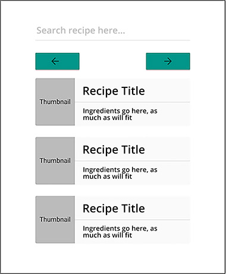

# Femtec Health React Coding Challenge

> Welcome to the Femtec Health Coding Challenge!

## Overview

To complete this challenge, you will need to write a simple [React](https://facebook.github.io/react/) web app, and provide us with access to a public repository containing the source files.

The purpose of this challenge is to assess your **skills and approach to composing a simple web app**, given a set of wireframe mockup screens and an API feed.

This challenge is expected to take about 1-3 hours.

## The Challenge

Your mission is to create a basic and minimal single-page react app implementing a recipe viewer. You will allow a user to enter a recipe query, and then you will render the top entries of that recipe api results.

For example, if I entered `omelete` or `chicken` into the app I would see recipes related to this. Using the provided wireframe screens as inspiration for the layout, you'll need to build a **set** of React components to render the app. You'll also need to request a JSON feed, filter that data, and use the relevant fields to display the data.

Here's the wireframes for this screen. Use this as a guide for a potential layout for your app:

As this is just a wireframe reference, feel free to implement both the design (UI) and functionality however you see fit.

### Requirements

- A user should be able to search for a recipe in an input field and view the results.
- The recipe results could be fetched based on changes to the input field, on input blur, a submit button (missing from the sample wireframe), or anything else you choose.
- The app should display three recipes at a time, providing pagination buttons (or another method you choose) to move through the longer list.

## Solution Format - Submission

Although this is a basic exercise, we'll be looking for **simple, well-designed and tested code** in the submission.

To simplify setting up and developing the solution, please use [Create React App](https://github.com/facebook/create-react-app), using `Typescript`.

You should not use any state management libraries (e.g. Redux), or implement routing, but feel free to use any UI libraries (e.g. [Chakra UI](https://chakra-ui.com/)) and any other 3rd party libraries as you see fit.

We expect the implementation to be done using the latest React standards, using functional components, hooks etc.

We would like to see some `tests` implemented as well, if time permits, using `Jest` and [React Testing Library](https://testing-library.com/docs/react-testing-library/intro/).

Submit your solution by emailing us a public repo url containing the source code. Please use frequent and detailed commits and/or Pull Requests, so we can follow through your development process.

Please include a `README` with any setup instructions, and any tests or other documentation you created as part of your solution.

Also, add the following info to your `README`:

- Are there any improvements you could make to your submission?
- What would you do differently if you were allocated more time?
- How would you have aprroached this differently if it was a requirement for a larger codebase / project?
- How did you decide on which libraries and technologies to use as part of your solution?

## Details

You will be using the [MealDB API](https://www.themealdb.com/api.php) to fetch the recipes.

All recipes can be fetched by using `https://www.themealdb.com/api/json/v1/1/search.php?s=query` where query is the recipe search key from the user input.
You can use just the first ingredient as reference, no need to build a functionality to map and display all ingredients.

Please create components for each part of the page (eg. header, content, footer, etc).
Some assets that might be needed are provided in the `assets` folder.

You should focus more on functionality, but we would like to see how you approach UI / UX details as well.

The end result should also be usable (but not polished) on mobile devices.

You can assume that you do not have to support legacy browsers without features such as `fetch` or `flexbox`.

## What do I do if I have questions or find the instructions unclear?

Please contact us about any issues or clarifications via linkedin or email.

## Useful Links

- [Github](https://github.com/)
- [React Docs](https://facebook.github.io/react/)
- [Create React App](https://github.com/facebook/create-react-app)
- [React Testing Library](https://testing-library.com/docs/react-testing-library/intro/)
